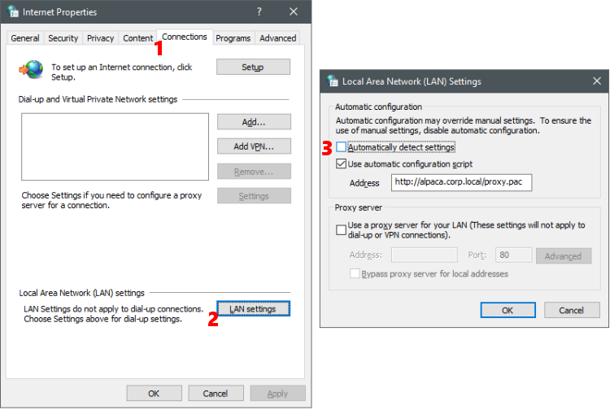
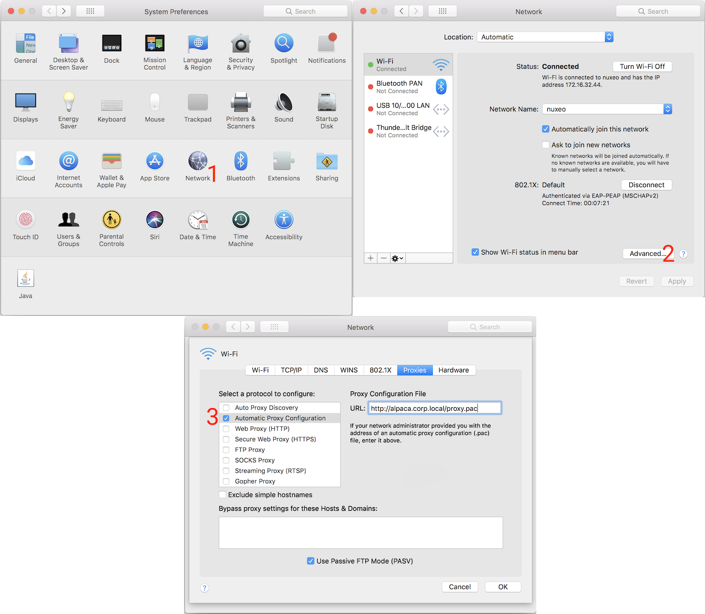

Proxy auto-configuration (PAC) files
====================================

An introduction to PAC files and why you may (or may not) care about them in your internet-accessing Python code.

What they are
-------------

A proxy auto-config (PAC) file is a text file that defines a JavaScript function: ``FindProxyForURL(url, host)``.
For every URL accessed by a client, the function is executed in order to determine the proxy server (if any) to use
for that URL.

The `PAC specification`_ was created by Netscape in 1996. The specification defines a set of JavaScript functions that
are available in the execution context of a PAC file. These functions enable a lot of flexibility in proxy rules:
configurations can vary based on any part of the URL, the IPs that domains resolve to, the current date and time,
and more.

The alternative to PAC files is to configure each client with a single proxy server to use for all URLs,
plus a list of whitelisted hostnames that should bypass the proxy and be accessed directly.
The ``HTTP_PROXY``, ``HTTPS_PROXY``, and ``NO_PROXY`` environment variables are recognized by Requests for this purpose.
This is simpler than a PAC file, but also less powerful.

`Wikipedia`_ has further details regarding PAC files.

.. _PAC specification: http://findproxyforurl.com/netscape-documentation/
.. _Wikipedia: https://en.wikipedia.org/wiki/Proxy_auto-config

There are also `Microsoft extensions`_ that add IPv6 functions to PAC files.

.. _Microsoft extensions: https://learn.microsoft.com/en-us/windows/win32/winhttp/ipv6-aware-proxy-helper-api-definitions

.. _who-uses-pacs:

Who uses them
-------------

PAC files are used by organizations that require fine-grained and centralized control of proxy configuration.
They're commonly deployed in government and institutional networks. If your organization is behind a firewall such as
Forcepoint WebShield (Websense) or Symantec Web Gateway, then it's likely that PAC files are in use.
These web security firewalls provide access to the internet via proxies that are specified through a PAC file.

.. _wpad:

Am I using a PAC?
-----------------

If you're behind a network where internet access is only possible through a proxy,
there's a good chance that a PAC is in use.

Windows
^^^^^^^

If your network uses a PAC, it's usually the case that clients are running Windows.
On Windows, proxy settings are under Internet Options > Connections > LAN Settings:

If "automatically detect settings" is enabled, then Web Proxy Auto-Discovery is in use (see next section).
If "use automatic configuration script" is enabled, the address field contains the PAC URL.

These settings are often enforced through Group Policy,
which means that any changes will be overwritten with the official values from the Group Policy a few minutes later.

macOS/OSX
^^^^^^^^^

On macOS, proxy settings are under System Preferences > Network > Advanced... > Proxies:

If "Auto Proxy Discovery" is enabled, then Web Proxy Auto-Discovery is in use (see next section).
If " Automatic Proxy Configuration" is enabled, the address field contains the PAC URL.

Other operating systems
^^^^^^^^^^^^^^^^^^^^^^^

Other operating systems don't have a setting for the PAC URL.
Instead, the Web Proxy Auto-Discovery (WPAD) protocol is used to find the PAC.
This protocol defines two discovery methods: DNS and DHCP.

* The DNS method involves the client looking for a valid PAC file via a pattern of URLs based on the client's hostname.
* The DHCP method involves the client network's DHCP server providing a value for DHCP Option 252.

PyPAC currently only supports the DNS method.

How PAC files are served
------------------------

PAC files are typically hosted within the intranet on a web server that's anonymously accessible by all clients.

PAC files intended to be discovered via WPAD are named ``wpad.dat`` by convention.
Otherwise, they're typically named ``proxy.pac``.

To comply with the PAC specification, the file should be served with a
Content-Type of ``application/x-ns-proxy-autoconfig``.
Otherwise, PyPAC will ignore them. However, this behaviour can be configured.

How PyPAC works
---------------

PyPAC implements PAC file discovery via Windows Internet Options and the DNS portion of the WPAD protocol.
It implements all of the functions necessary to execute a PAC file,
and uses the `dukpy`_ library to parse and execute the JavaScript.
On top of this, PyPAC implements tools to track proxy failover state,
and to convert the return value of the JavaScript function into a form understood by the Requests API.

Every request made using a :class:`PACSession <pypac.PACSession>` consults the PAC file in order to determine
the proxy configuration for the given URL.

DHCP WPAD is currently not implemented.

.. _dukpy: https://pypi.org/p/dukpy

Can't I just hard-code the proxy?
---------------------------------

One way to avoid the burden and complexity of using a PAC file is to open the PAC file, figure out which proxy to use,
and then hard-code it somewhere, such as an environment variable, or as a constant for the ``proxies`` argument.
In many cases this is good enough, but there are scenarios where it can be fragile:

* Execution on machines you do not control, or portability across
  network environments both inside and outside your firewall
* Valid proxy hosts changing days, months, or years after being hard-coded
* PAC file contains datetime-based logic that must be followed to yield a valid proxy
* ``NO_PROXY`` environment variable not granular enough for your use case
* Your application needs to access arbitrary URLs
* Your application's users have a PAC, but don't have the expertise
  to be aware of its existence or to implement workarounds

In these scenarios, the effort of automatically searching for and honouring a PAC file (if any)
adds flexibility and resilience to your application.
